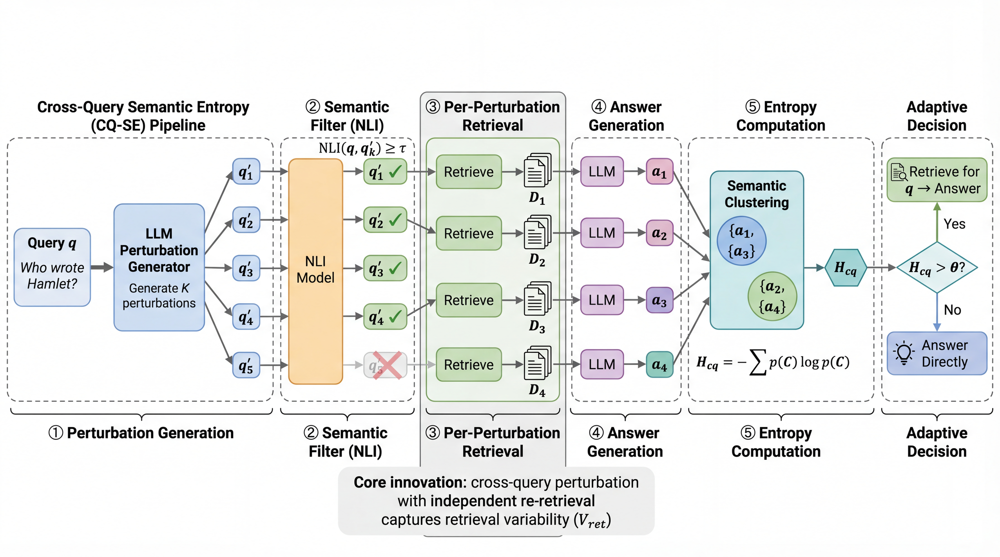

# Cross-Query Semantic Entropy for Adaptive Retrieval in RAG

[](https://www.ieeesmc2026.org/)
[](https://www.ieeesmc2026.org/)
[](https://www.python.org/)
[](#method-overview)

This repository contains the official implementation of **Cross-Query Semantic Entropy (CQ-SE)**, a training-free uncertainty signal for adaptive retrieval-augmented generation.

CQ-SE asks a simple question: if a query is rewritten in several meaning-preserving ways, and each rewrite retrieves its own evidence, does the model still give the same answer? Stable answers indicate that the model can likely answer from its parametric knowledge; answer disagreement across retrieval contexts signals that external retrieval is needed.



## Paper

**Cross-Query Semantic Entropy for Adaptive Retrieval in RAG**  
Zhuojin Wang, Harbin Engineering University

Accepted for presentation at the **2026 IEEE International Conference on Systems, Man, and Cybernetics (SMC 2026)**.

| Item | Details |
| --- | --- |
| Conference | IEEE SMC 2026 |
| Location | Bellevue, WA, USA |
| Dates | October 4-7, 2026 |
| Manuscript ID | 2206 |
| Conference website | https://www.ieeesmc2026.org/ |
| Proceedings / DOI | To appear |

## Highlights

- **Retrieval-dependent uncertainty.** CQ-SE measures answer disagreement across independently retrieved contexts, rather than only sampling answers from one fixed query-context pair.
- **Training-free.** The method uses query paraphrasing, dense retrieval, deterministic answer generation, and NLI-based semantic clustering.
- **Strong retrieval-necessity detection.** On five QA benchmarks and two model scales, CQ-SE achieves **0.636-0.723 average AUROC**, outperforming SUGAR and INTRYGUE by **18-37 percentage points**.
- **Positive scaling behavior.** CQ-SE improves from Qwen2.5-7B-Instruct to Qwen2.5-72B-Instruct, while the compared uncertainty baselines degrade in the reported setting.

## Method Overview

Given a user query `q`, CQ-SE estimates whether retrieval is needed by probing how sensitive the answer is to retrieval variation:

1. Generate `K=10` semantically equivalent query paraphrases.
2. Retrieve top-5 passages independently for each paraphrase using BGE-large-en-v1.5.
3. Generate one deterministic answer for each paraphrase-context pair.
4. Cluster answers with a DeBERTa-v2-xlarge-MNLI entailment model.
5. Compute cross-query semantic entropy over the answer clusters.
6. Trigger adaptive retrieval when entropy exceeds a tuned decision threshold.

The key distinction from within-query semantic entropy is the source of variation: standard SE varies the generation seed under a fixed retrieved context, while CQ-SE varies the retrieval context through semantically equivalent query reformulations.

## Repository Layout

The public release keeps the original experiment-oriented structure while excluding datasets, model caches, generated outputs, submission records, and local run artifacts.

```text
.
├── assets/
│   └── framework_overview.png
├── exp/
│   ├── cross_query_se/        # CQ-SE implementation, baselines, scripts, analysis
│   ├── DTR/                   # Minimal DTR-compatible data/evaluation helpers
│   └── data/                  # Empty by default; see exp/data/README.md
├── .env.example               # Non-secret configuration template
├── requirements.txt
└── README.md
```

## Installation

```bash
python -m venv .venv
source .venv/bin/activate
pip install -r requirements.txt
cp .env.example .env
```

Edit `.env` for your local environment. In particular, set `HF_HOME` to your Hugging Face cache directory. Keep API keys in local environment variables or `.env`; do not commit secrets.

## Data Preparation

Datasets are **not redistributed** in this repository. The release provides download and conversion scripts instead.

From the experiment directory:

```bash
cd exp
python cross_query_se/scripts/download_datasets.py
```

This prepares DTR-compatible benchmark files under `exp/data/` for:

| Dataset | Public source used by the script | Split |
| --- | --- | --- |
| NaturalQuestions Open | `nq_open` | validation |
| WebQuestions | `web_questions` | test |
| TriviaQA | `trivia_qa`, `unfiltered` | validation |
| HotpotQA | `hotpot_qa`, `fullwiki` | validation |
| SQuAD | `rajpurkar/squad` | validation |

Open-domain retrieval also expects a local Wikipedia passage corpus and BGE index:

```text
exp/data/21MWiki/psgs_w100.tsv
exp/data/21MWiki_bge/faiss_index_emb
exp/data/21MWiki_bge/corpus_embeddings.npy
```

After preparing the passage corpus locally, build the retrieval index with:

```bash
cd exp
bash cross_query_se/scripts/run_build_index.sh
```

See `exp/data/README.md` for the expected local data layout.

## Quick Start

Run the environment check:

```bash
cd exp
bash cross_query_se/scripts/verify_gpu_env.sh
```

Run a small CQ-SE sanity check on NaturalQuestions:

```bash
cd exp
bash cross_query_se/scripts/run_cross_query_se_sanity.sh
```

Run the main CQ-SE pipeline:

```bash
cd exp
bash cross_query_se/scripts/run_cross_query_se.sh
```

Run baseline and ablation scripts:

```bash
cd exp
bash cross_query_se/scripts/run_sugar_baseline.sh
bash cross_query_se/scripts/run_intrygue_baseline.sh
bash cross_query_se/scripts/run_ablation_no_reretrieval.sh
bash cross_query_se/scripts/run_ablation_no_nli_filtering.sh
bash cross_query_se/scripts/run_ablation_tau_sweep.sh
```

Long-running scripts assume GPU access and local model/cache availability. The provided shell scripts infer `EXP_DIR` from their own location; you can override it manually:

```bash
EXP_DIR=/path/to/repo/exp bash cross_query_se/scripts/run_cross_query_se_sanity.sh
```

## Main Components

- `cross_query_se/perturbation/`: query rewrite generation and semantic filtering
- `cross_query_se/retrieval/`: BGE retriever wrapper for per-perturbation retrieval
- `cross_query_se/uncertainty/`: within-query SE, cross-query SE, and INTRYGUE-style scoring
- `cross_query_se/adaptive/`: adaptive retrieval trigger policies
- `cross_query_se/analysis/`: retrieval-variance analysis and plotting
- `cross_query_se/scripts/`: experiment, baseline, ablation, and verification scripts

## Reproducibility Notes

- Main experiments use Qwen2.5-7B-Instruct and Qwen2.5-72B-Instruct.
- The dense retriever is BGE-large-en-v1.5 with top-5 passage retrieval.
- CQ-SE uses `K=10` query paraphrases and NLI threshold `tau=0.75`.
- Reported experiments use three random seeds: `0`, `1`, and `2`.
- Generated outputs should stay under `exp/cross_query_se/outputs/` or `exp/cross_query_se/results/`; both are git-ignored.
- Dataset files, indexes, model weights, Hugging Face caches, logs, and local notes are intentionally excluded.

## Citation

Citation information will be added after the paper appears in the official conference proceedings.

## Release Hygiene

This public source tree intentionally does not include:

- benchmark datasets or derived dataset files
- Wikipedia corpora, embeddings, FAISS indexes, or model checkpoints
- Hugging Face caches or local environment files
- generated experiment outputs and logs
- acceptance letters, submission-system screenshots, or private project notes

Before publishing, run the repository checks described in the project preparation notes and confirm that no local data or private artifacts have been staged.
